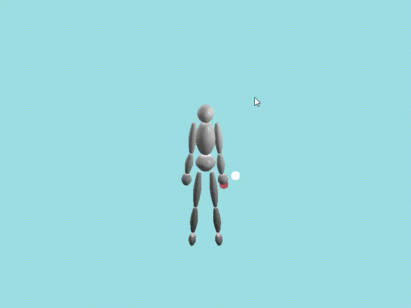
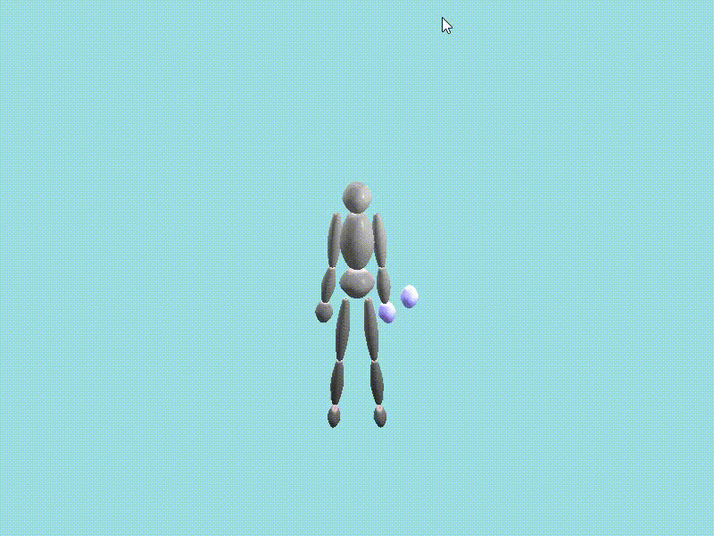

# OpenGL Inverse Kinematic

opengl로 inverse kinematic을 구현해 보았습니다.  

gradient descent 방법과 jacobian을 계산하는 방법 두가지로 구현해 보았습니다.  

사용된 object는 swept surface로 직접 제작하였고 hierarchical  구조로 만든 후 적용하였습니다.  

swept surface를 만드는 방법은 https://github.com/Doheon/OpenGLProject 에 나와있습니다.  

&nbsp;

###  gradient descent 방법으로 구현한 inverse kinematic

&nbsp;

### jacobian을 계산하여 구현한 inverse kinematic

&nbsp;

### forward kinematic으로 구현한 달리는 모습  

