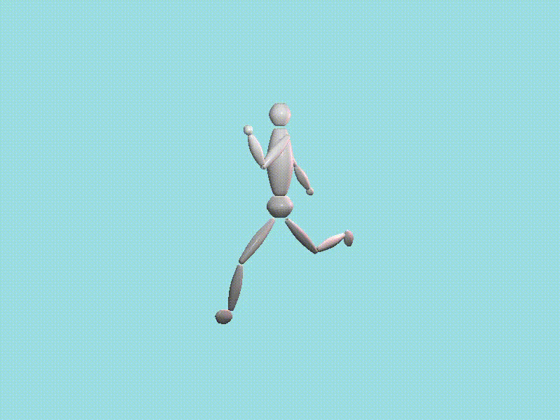

# OpenGL Inverse Kinematic

opengl로 inverse kinematic을 구현해 보았습니다.  

gradient descent 방법과 jacobian을 계산하는 방법 두가지로 구현해 보았습니다.  

사용된 object는 swept surface로 직접 제작하였고 hierarchical  구조로 만든 후 적용하였습니다.

gradient descent 방법으로 구현한 inverse kinematic

&nbsp;

jacobian을 계산하여 구현한 inverse kinematic

&nbsp;

forward kinematic으로 구현한 달리는 모습  

